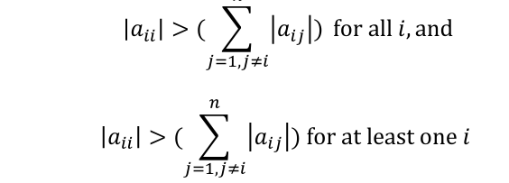

# Iterative Solutions to Linear Systems

## Jacobi Method
- Assume all diagonal elements are nonzero
  - If not the case; arrange for this

- Consider x0 = \[0, 0, 0, ...\]
- The more iterations, the more accurate

## Gauss-Seidel Method
- Use Jacobi Method but use x^k instead of x^(k-1)

- Takes less iterations to solve

## Gauss-Seidel w/ SOR
- Add a relaxation factor (w)

- If w = 1, equivalent to [Gauss-Seidel Method](##-Gauss-Seidel-Method)
- Basically, that fancy sum function is just what you get when you isolate your variable
  - Ex: 7a + 1b -1c + 2d = 3
  - Solve for a = (3 - b + c - 2d)/7
  - w\[(3 - b + c - 2d)/7\] - (1 - w)a^(k-1)
- a^(k-1) is just the previous SOR solution
  - So if this is k = 1 iteration, k-1 is k = 0, which is always \[0, 0, 0, ...\]
  - So (1 - w)(0) in this case!

## Convergence
- To converge starting vector, coefficient matrix

## Convergence Error Check
- Error = || x^k - x^(k-1) || / || x^k ||
